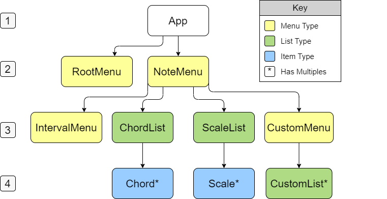

# Interactive Chord & Scale Dictionary

## Author: Tyler Yates

This project provides a centralized place for musicians and music students to access resources such as scales, chord types/guitar chord diagrams, intervals, and more.

### Setup/Installation

1. Clone the project using `git clone https://github.com/YTyler/chordBook.git`  

2. Navigate to the created project directory `cd chordBook`

3. Run `ionic serve`    

### Known Bugs

### Contact Info

The author can be contacted via email at tyates907@gmail.com

### Technologies Used
* React
* Ionic
* tonaljs
* vexchords

## Project Structure 

## License

MIT License

Copyright (c) 2019 Tyler Yates

*Permission is hereby granted, free of charge, to any person obtaining a copy
of this software and associated documentation files (the "Software"), to deal
in the Software without restriction, including without limitation the rights
to use, copy, modify, merge, publish, distribute, sublicense, and/or sell
copies of the Software, and to permit persons to whom the Software is
furnished to do so, subject to the following conditions:*

The above copyright notice and this permission notice shall be included in all
copies or substantial portions of the Software.

THE SOFTWARE IS PROVIDED "AS IS", WITHOUT WARRANTY OF ANY KIND, EXPRESS OR
IMPLIED, INCLUDING BUT NOT LIMITED TO THE WARRANTIES OF MERCHANTABILITY,
FITNESS FOR A PARTICULAR PURPOSE AND NONINFRINGEMENT. IN NO EVENT SHALL THE
AUTHORS OR COPYRIGHT HOLDERS BE LIABLE FOR ANY CLAIM, DAMAGES OR OTHER
LIABILITY, WHETHER IN AN ACTION OF CONTRACT, TORT OR OTHERWISE, ARISING FROM,
OUT OF OR IN CONNECTION WITH THE SOFTWARE OR THE USE OR OTHER DEALINGS IN THE
SOFTWARE.

<!-- old requirements -->
<!-- ### Minimum Features:

* Scale and Chord Lists that direct to more specific lists/diagrams
* Place to Enter a Note/Notes
* Interval Display

### Technologies Used

* Javascript  
* React  
* Redux  
* UberChord API

### Stretch Goals

* Users can saves sets of chord diagrams/scales under custom names
* User can click on notes in a scale to play that note’s tone
* Add chord diagrams for other instruments
* Add more complex/non-western/microtonal scales

### Additional Technologies

* React-sound
* Possibly other sound library
* Additional Chord API -->
